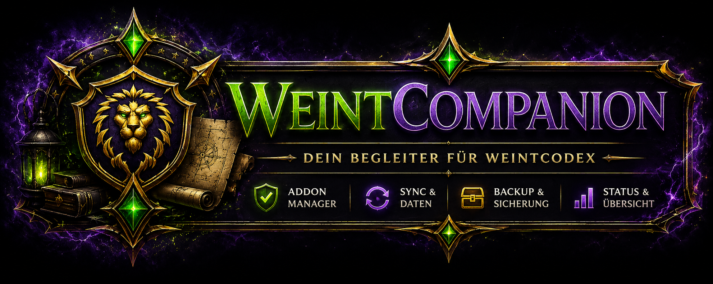

# WeintCompanion

<p align="center">
  
</p>

<p align="center">
  <strong>Die offizielle Desktop-Anwendung für WeintCodex.</strong><br>
  Installieren, aktualisieren und zukünftig mit Discord synchronisieren – alles über eine zentrale Oberfläche.
</p>

---

# Übersicht

**WeintCompanion** ist die offizielle Desktop-Anwendung für das World of Warcraft Addon **WeintCodex**.

Die Anwendung übernimmt die Installation und Aktualisierung des Addons, erstellt automatisch Backups und bildet die Grundlage für die zukünftige Kommunikation zwischen Addon und Discord-Bot.

Langfristig entsteht dadurch ein geschlossenes Ökosystem aus:

* 📦 **WeintCodex** – World of Warcraft Addon
* 🖥️ **WeintCompanion** – Desktop-Anwendung
* 🤖 **WeintCodex Bot** – Discord-Bot

Dadurch gehören manuelle Downloads, das Kopieren von Dateien und komplizierte Installationen der Vergangenheit an.

---

# Funktionen

## 🏠 Dashboard

* Übersicht über den aktuellen Status
* Automatische Erkennung der World of Warcraft Installation
* Anzeige der installierten Addon-Version
* Vergleich mit der neuesten GitHub-Version
* Installation oder Update mit nur einem Klick

---

## 📦 Addon-Verwaltung

* WeintCodex installieren
* Vorhandene Installation aktualisieren
* Installierte Version anzeigen
* Neueste GitHub-Version anzeigen
* Addon-Ordner direkt öffnen
* Automatische Backups vor jedem Update

---

## 🔄 Synchronisation

Die aktuelle Version enthält bereits die technische Grundlage für die spätere Synchronisation.

Geplante Funktionen:

* Synchronisation zwischen Addon und Discord-Bot
* Materialien
* Kalender
* Raidinformationen
* Bossdaten
* WeakAuren

---

## ⚙️ Einstellungen

* World of Warcraft Pfad verwalten
* Download-Cache löschen
* Backups löschen
* Grundeinstellungen verwalten

---

## 📋 Logging

Alle Aktionen innerhalb der Anwendung werden automatisch protokolliert.

Dazu gehören unter anderem:

* Installationen
* Updates
* GitHub-Abfragen
* Statusmeldungen
* Fehler
* Synchronisationsvorgänge

Zusätzlich wird eine Logdatei erstellt, die bei der Fehlersuche unterstützt.

---

# Unterstützte Betriebssysteme

| Betriebssystem | Status        |
| -------------- | ------------- |
| Linux          | ✅ Unterstützt |
| Windows        | ✅ Unterstützt |
| macOS          | 📅 Geplant    |

---

# Roadmap

## Version 1.0

* Dashboard
* Addon-Installation
* Update-System
* Backup-System
* Logging
* Grundlage für Synchronisation

## Version 1.1

* Automatische Updates für WeintCompanion
* Verbesserter Installer

## Version 1.2

* Verbindung zum Discord-Bot
* Automatische Synchronisation zwischen Bot und Addon

## Version 2.0

WeintCompanion entwickelt sich zur zentralen Verwaltungssoftware für das gesamte WeintCodex-Ökosystem.

---

# Projektstruktur

```text
WeintCompanion
│
├── addon/
├── assets/
├── cache/
├── core/
├── gui/
│
├── app.py
├── README.md
└── requirements.txt
```

---

# Entwicklung

WeintCompanion wird von **daddler2419** entwickelt und kontinuierlich erweitert.

Das Projekt entstand mit dem Ziel, die Verwaltung von **WeintCodex** zu vereinfachen und langfristig eine nahtlose Verbindung zwischen Addon, Desktop-Anwendung und Discord-Bot zu schaffen.

---

# Verwandte Projekte

* **WeintCodex** – World of Warcraft Addon
* **WeintCodex Bot** – Discord-Bot zur Verwaltung und Synchronisation
